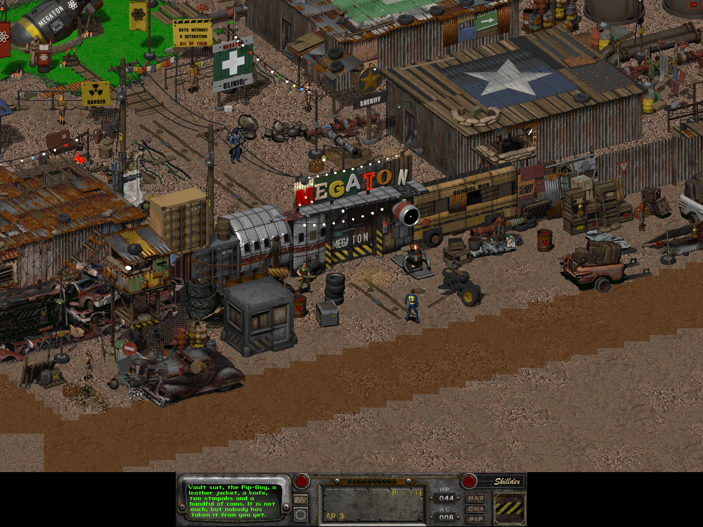
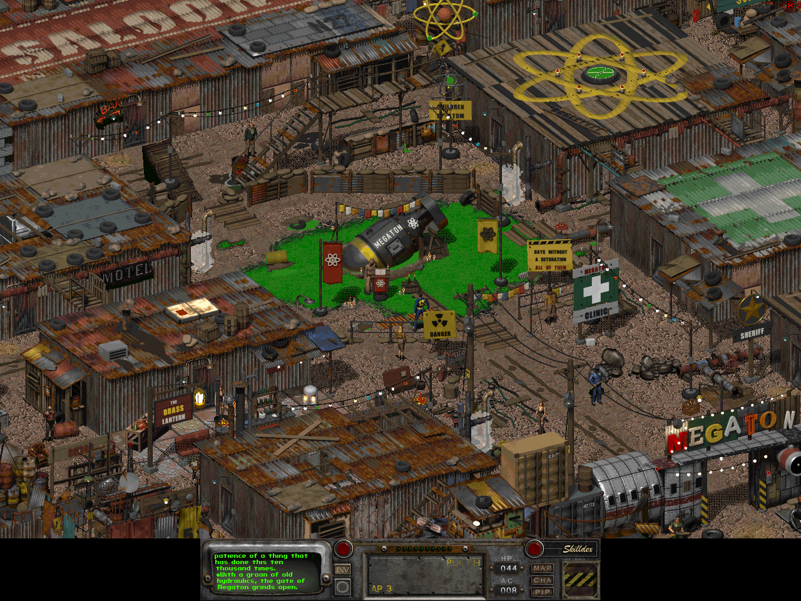

# Megaton for Fallout 2

An unofficial fan mod rebuilding Megaton as a classic isometric Fallout 2 town:
a wall of scrap, a busy saloon, and an unexploded bomb that everyone has an opinion about.

Explore a branching main quest, help the residents, trade, find a bed, and see
the consequences when you return. The town includes its own rendered scenery,
patchwork roofs, workshops, market stalls and street lighting. You supply the
Fallout 2 game files; no Fallout 3 installation is needed.





## Requirements

- An unmodified **English GOG copy of Fallout 2**. Setup checks the tested game
  tables and prototype inputs before preparing anything. Other editions and
  languages are unverified and may be rejected.
- [Fallout 2 Community Edition](https://github.com/alexbatalov/fallout2-ce),
  installed with your game data. The original 1998 executable is unsupported.
- Python 3.10 or newer, NumPy and Pillow.
- About 1.5 GB free for the extracted game cache, plus room for preserved builds.

The ordinary player build uses the committed own sprites and verified compiled
scripts. It does not require Blender, OpenCV, Node or a script compiler.

## Install

This repository is private; cloning requires a GitHub account with access and
Git authentication already configured. Run the commands below from a terminal.
Replace `../Fallout2` with your game's folder; it must contain `master.dat`,
`critter.dat` and `patch000.dat`. Quote a path containing spaces.

```sh
git clone https://github.com/Apolotary/fallout2-megaton.git
cd fallout2-megaton
python3 -m venv .venv
source .venv/bin/activate
python -m pip install -r requirements.txt
python megaton.py setup --game "../Fallout2"
python megaton.py build
python megaton.py install
python megaton.py status
```

Stop if any command fails; resolve its error before continuing. In particular,
a rejected game profile must not be bypassed by changing the supplied hashes.

On Windows PowerShell, create the environment with `py -3 -m venv .venv` and
activate it with `.venv\Scripts\Activate.ps1` instead of `source`. The remaining
commands use the environment's `python`. Windows has not been tested.

Setup remembers your selection under ignored `game/`. You can select a different
source with `--game DIR` or `FALLOUT2_DIR`; the explicit option takes precedence.
It reads the three original archives, merging `patch000.dat` over their data,
and prepares local headers, two map prefabs and the artwork needed for the build.
Loose installation mods and additional patch archives are not setup inputs. Game-derived tiles and tables are generated
locally rather than distributed here.

Build writes `mod/megaton/out/patch001.dat`. Install places that archive next to
the game's original archives. It refuses to overwrite a foreign or modified
`patch001.dat`. Keep other gameplay mods in a separate installation: Megaton
replaces several complete game tables and has not been tested in combinations.

To install into a separate copy, use `python megaton.py install --target DIR`.
An extracted game-data tree is also accepted as a build input, but requires a
separate complete game installation as the explicit target.

For the expanded artwork, set `art_cache_size=24` in the `[system]` section of
your game's `fallout2.cfg`. The installer does not edit your configuration.

## Play

Launch fallout2-ce and start a **new game**. After leaving Arroyo, look south-east
on the world map for Megaton's circle; it can initially be labeled **Unknown**.

To start directly outside the gate, add the following to your game's `ddraw.ini`:

```ini
[Misc]
StartingMap=megaton.map
```

Approach Deputy Weld to enter. Stand near beds and examine them to rest; use the
relevant skill or item on Walter's pipes as the in-game instructions describe.
Keep mod saves separate. Older saves can retain an earlier map, and compatibility
with saves from before installation has not been verified.

## Uninstall

```sh
python megaton.py uninstall
```

This moves the matching archive installed by this checkout into ignored
`game/retained/`. It leaves foreign or modified archives alone. If you added
`StartingMap=megaton.map`, remove that line before beginning an unmodified game.
Keep the mod available for saves that depend on it.

## Development and verification

The town is built by `mod/megaton/layout/` and `cast/`; its script sources and
dialogue are in `mod/megaton/scripts/`. Art source is in `mod/megaton-art/`.

Changing script sources requires the pinned external compiler. The build checks
the complete source/header dependency hash before using committed bytecode.
`python megaton.py build --verify-prebuilt` requires that compiler and compares a
fresh compilation with all 40 committed scripts. Follow the
[manual compiler setup](docs/testing.md#script-compiler) before using it;
compiler software is not distributed here.

Blender and the separate `requirements-art.txt` dependencies are for art authors.
Sign rendering currently requests macOS fonts; no font software is included.
Setup restores the committed sprite bytes and composes floor decals using your
game's ground tiles. It does not re-render art. See the
[art author workflow](docs/testing.md#art-authoring) before changing the reviewed
sprite inventory or frozen tile ledger.

See [testing](docs/testing.md), [known issues](docs/known-issues.md), and
[notices](NOTICE.md) for the verification record and remaining limitations. On
macOS, a clean exported copy passed setup, build, install and uninstall checks
and reproduced the accepted game archive byte for byte. All 40 production scripts
passed fresh compilation checks. The optional test-engine patch compiled and
passed all 44 core scenarios. Native checks cover startup, direct-gate rendering
and save/load on an unpatched build; the official v1.3.0 check covers startup
only. Manual world-map travel, gate entry, NPC dialogue and trade remain
unverified. See the testing record for the exact engine versions and scope.

## Licences

An unofficial, non-commercial fan project.

Copyright (c) 2026 Apolotary. Fallout, Megaton and
their characters and settings belong to their respective rights holders.

Project code uses the [Sustainable Use License](LICENSE). The specifically
identified Blender script components use MIT; the mod's own art and writing use
[CC BY-NC-SA 4.0](LICENSE-CONTENT.md). These licences cover only the contributions
their authors can license. See [NOTICE.md](NOTICE.md) for upstream code and the
exact Blender boundary.

Game archives, stock asset files, saves, and music are excluded. The two README
screenshots depict the mod running with Fallout 2 game art and interface elements;
they are not covered by this project's code or content licence. Do not attach
game files or private machine details to issues or pull requests.
